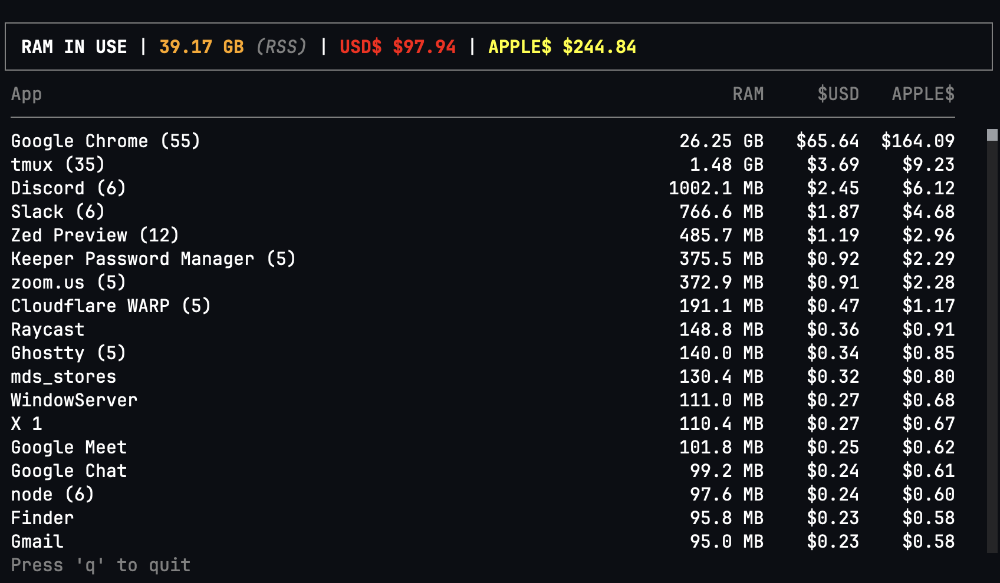

## ram-to-usd

RAM is getting expensive. What processes are eating the most $$?



### Install

```bash
# requires bun and zig
brew install oven-sh/bun/bun zig

# install globally
bun install -g ram-to-usd

# or run directly
bunx ram-to-usd
```

### Build from source

```bash
git clone https://github.com/elithrar/ram-to-usd
cd ram-to-usd
bun install
bun run build  # outputs to dist/ramtousd
```

### Usage

```bash
ramtousd
```

Press `q` or `Escape` to quit.

### How it works

Memory is measured using RSS (Resident Set Size), not virtual memory. RSS represents the actual physical RAM a process is using, though there's some inaccuracy when multiple processes share memory pages - the same memory can be counted more than once.

Also worth noting: modern operating systems *want* to use your RAM. If you have 48GB, you should expect most of it to be in use - that's the OS doing its job, caching files and keeping things fast. An empty RAM bar isn't a badge of honor.

### Configuration

Create `~/.config/ramtousd.jsonc` to customize pricing:

```jsonc
{
  // PCPartPicker DDR5 average
  "regularPricePerGB": 2.50,
  // Apple's memory upgrade pricing
  "applePricePerGB": 6.25,
  // Refresh interval in ms
  "refreshIntervalMs": 1000
}
```

### License

Apache-2.0
